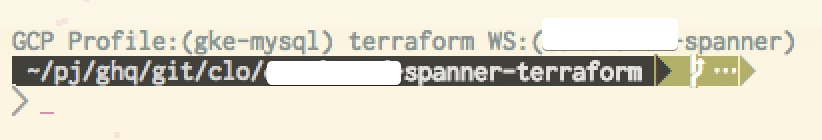

# fish-shell-indicators
indicators for my work.

## functions

* ✅ GCP Cloud SDK (gcloud) profile name
* ✅ Terraform current workspace

# how to install

1. copy files in `config/fish/functions/*.fish` into your `$XDG_HOME/fish/functions/`
1. append those lines into your `config/fish/functions/fish_prompt.fish` : from `fish_prompt-part.fish`
1. start the new fish shell

# screenshot

